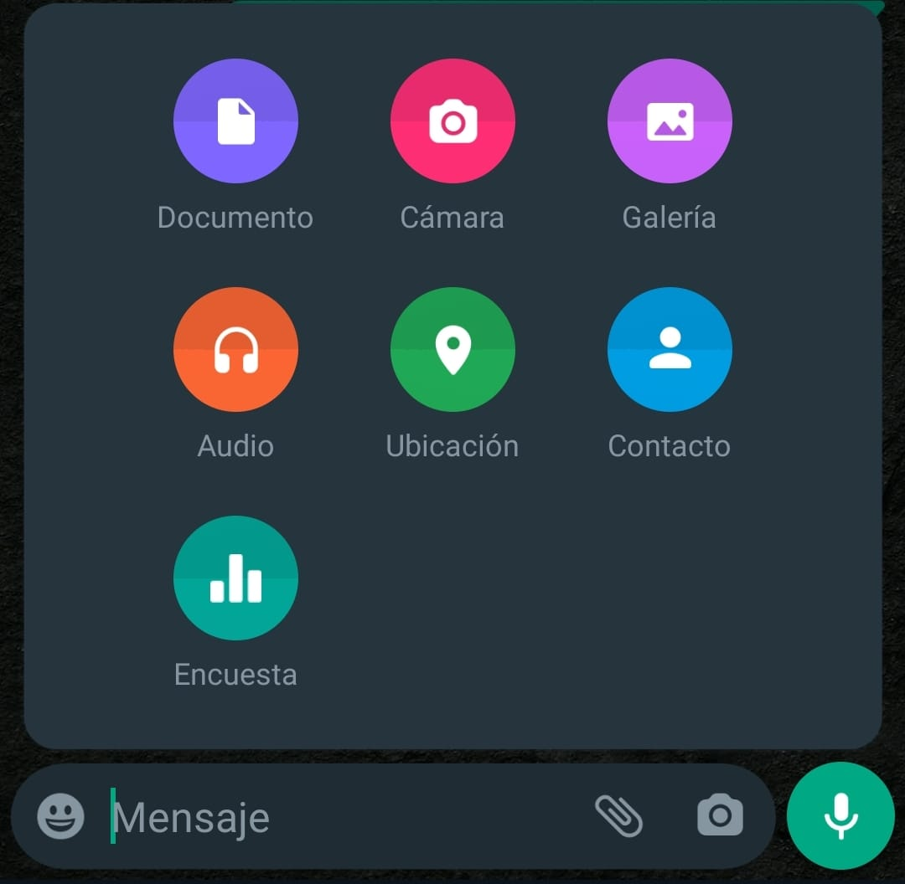

**REPTE-ACTIVITAT 3:**
## Visionant el futur amb les ulleres de Manovich: redescobrint la hibridació
---

# :open_file_folder: Plantejament:

#   Parcs Disney: 

Lev Manovich ens diu al seu llibre "El software toma el mando" que "Los híbridos pueden combinar y reconfigurar formatos de medios conocidos e interfaces de medios para ofrecer nuevos tipos de representación híbridas ." (Manovich, 2013). Per tant, podem considerar els parcs Disney com a elements híbrids en l'àmbit de l'entreteniment i de l'experiència multimèdia. Ho considero així per la infinitat de combinacions de diferents medis i de les diferents tecnologies utilitzades ja no només en les atraccions, sinó també en la recreació de l'univers Disney i la forma amb la qual els usuaris hi poden interactuar, passant a ser una part activa d'aquest món.

L'experiència en aquests parcs comença abans d'entrar-hi. Es podem fer tours virtuals a través de Google Earth o a través de la pàgina de visitorlando.com, en el cas del parc d'aquesta ciutat. Mentre ens dirigim al parc, podem descarregar l'aplicació mòbil que ens ajudarà a geolocalitzar-nos dins del parc, conèixer el temps d'espera a cada atracció, o a fer reserves pels restaurants. També podem controlar els horaris de diferents espectacles o les rues itinerants dins del parc, i tot des d'una mateixa interfície d'usuari a través de la mateixa app.

Si parlem de les atraccions d’última generació que existeixen avui en dia, som incapaços d’imaginar tota la tecnologia combinada que existeix a cada una d’elles. Per posar un exemple on es combinen moltes d’aquestes tecnologies en una sola atracció, podem parlar de la de Ratatoullie, que ens submergim a una història on ens posem a la pell d’un ratolí que recorre i s’amaga per tots els racons de la cuina d’un restaurant.  

Per simular això l'usuari és transportat, amb ulleres 3D i en un vehicle autònom sense raïls, per diferents habitacions ambientades amb la pel·lícula del mateix nom. A través de projeccions de pantalla 3D a cada sala, també apareixen efectes reals com olors, aigua, aire i canvis de temperatura, que fan que l'usuari es transporti realment a la història que l'atracció ens vol explicar. A més, es combina el moviment del vehicle amb la sincronització dels efectes sonors i 4D per generar una immersió total.

En aquest cas particular podem dir que no es tracta d'un software que utilitzi l'usuari a través d'una sola interfície, però sí que podem dir que la combinació de tots aquests elements multimèdia em generen un de nou i únic, impossible de generar si aïlléssim tots els medis de forma individual.

L'aplicació mòbil que hem mencionat al principi també forma part d'aquest conjunt de medis que fan que visitar un parc Disney sigui una experiència hibrida. Utilitzant el dispositiu mòbil i connexió a internet, l'aplicació fa de nexe entre el visitant i el parc. És la forma que té l'usuari d'interactuar amb tot allò que l'envolta i li facilita conèixer, a través de vídeos imatges i ressenyes, totes les atraccions, els restaurants o els espectacles abans d'anar-hi.

Qui hagi estat en un parc Disney, també sabrà que cada nit abans de tancar les portes, es recrea un espectacle al centre del parc on es reprodueix un videomaping sobre la façana del castell, combinant música, vídeo i pirotècnia.

---

#   WhatsApp:
Podem considerar WhatsApp com un exemple d'element híbrid en l'àmbit de les aplicacions de missatgeria instantània, consum de multimèdia i comunicació digital. Com hem vist en l'anterior exemple, Manovich defineix els elements híbrids com aquells que combinen característiques i funcionalitats de diferents medis i tecnologies, creant d'aquesta manera una nova forma d'interacció i experiència.

Des de fa anys existeixen aplicacions semblants de missatgeria que combinen elements multimèdia, però cap ho ha aconseguit fer com WhatsApp avui dia. A més, el fet de simplificar el seu ús en un dispositiu utilitzat de forma massiva, com és el telèfon mòbil, fa que m'atreveixi a afirmar que actualment és la principal eina de comunicació que existeix entre persones.

A través d'aquesta plataforma l'usuari pot crear, modificar i compartir diferents elements multimèdia integrats en una mateixa interfície d'usuari. També permet, que a partir d'una enquesta, cada membre d'un grup pugui votar la seva opció sobra una consulta feta per un usuari. Una eina que va néixer com a missatgeria de text i posteriorment va incorporar l'enviament d'imatges, ha evolucionat en un element híbrid on conviuen múltiples eines, medis i tecnologies. El que avui ens sembla quelcom tan obvi com enviar una foto inmediatament a un contacte, per per exemple ensenyar que estem dinant, fa només 12 anys era inpensable. Recordo perfectament el primer cop que vaig enviar una foto per WhatsApp en un viatge a Nova Zelanda el 2010, i enviar una foto d'una platja a un amic que vivia a Barcelona. Durant molt de temps allò em va semblar alucinant. 

Avui podem compartir la nostra ubicació actual, o una d’aproximada, o compartir-la en directe durant un període de temps determinat amb un contacte o en un grup amb més gent. Per aconseguir-ho, la plataforma integra a la mateixa eina els mapes de Google o Apple (segons el sistema operatiu). Altres eines externes integrades son Tenor o Giphy per enviar gifs animats. 
Això també ens demostra com s'adapta l'aplicació segons des de quin sistema operatiu s'executa, ja que a part de dispositius mòbils Android o Apple, també podem utilitzar WhatsAPP web o l'aplicació d'escriptori per ordinador, que detectarà si disposem o no de GPS per compartir ubicació, i ens permetrà també accedir al disc dur de l'ordinador per poder enviar qualsevol element, sigui un document, imatge contacte o fins i tot generar stickers.

Altres tecnologies de diferents medis que incorpora WhatsApp i que una vegada més demostra com ha revolucionat i canviat la forma com ens comuniquem, són les notes de veu. Per què fer una trucada que dependrà de la disponibilitat de l'altra persona, si el que li vull dir es pot explicar en un àudio curt de menys de 10 segons? Premo el botó de micròfon, parlo i deixo anar el botó per enviar. També podem fer videotrucades grupals on tornem a combinar vídeo i àudio amb tecnologia mòbil i connectivitat a internet en una sola interfície.

Per acabar, cal destacar com queda palesa la hibridació de WhatsApp quan combinem elements físics com la càmera, amb el mateix software de l'aplicació i la connectivitat a internet per realitzar una vegada més la comunicació amb un sol individu o de manera grupal a través d'una videotrucada. Podem veure com a pantalla dividida l'aplicació ens permet fer una videotrucada (també de veu) amb diferents persones alhora.

De forma resumida, el que fa que des del meu punt de vista WhatsApp sigui l'aplicació hibrida per excel·lència, és el fet que des d'una sola interfície d'usuari, ens permeti interactuar amb tants elements multimèdia, amb una o vàries persones alhora, i gràcies als dispositius mòbils i connexió a internet puguem fer-ho des de qualsevol lloc.

# :paperclip: Bibliografia i Webgrafia:

- [El software toma el mando. Lev Manovich, 2013 [ePub]](https://campus.uoc.edu/tren/trenacc?s=af837de544b1f8eb53dc0300bb206e6988770dc89ffcf2abc6deac688314ac63435c51dfb4e5f8571be05b6ce98ca165bc20e6c37abf7ee9acfac921f13c987f&modul=DIMAX.DINAROJ/dimaxweb.Pagina&pantalla=HISTORICS&node=73486&entidad_gestora=DEF&entorn_gestio=PV20222&idioma=CAT&lang=&pantalla_his=XML_ARBRE_RECURSOS&cami=&p_entrada=PV)
- ["Remediación, multimedia e hibridación de los medios".](http://multimedia.uoc.edu/blogs/fem/es/remediacio-multimedia-i-hibridacio-dels-mitjans/)
- [Conocimiento Abierto y Tecnología](http://juan.psicologiasocial.eu/conocimiento-y-tecnologia)
https://es.wikipedia.org/wiki/Hibridaci%C3%B3n_de_medios 
- ["Hibridación de medios" (Wikipedia)](https://es.wikipedia.org/wiki/Hibridaci%C3%B3n_de_medios)
- [Wikipedia, (2021): "Lev Manovich".](https://es.wikipedia.org/wiki/Lev_Manovich)

---
:bust_in_silhouette: Roger Fogueras Bayarri  
:email: rfogueras@uoc.edu  
:date: Maig 2023  
