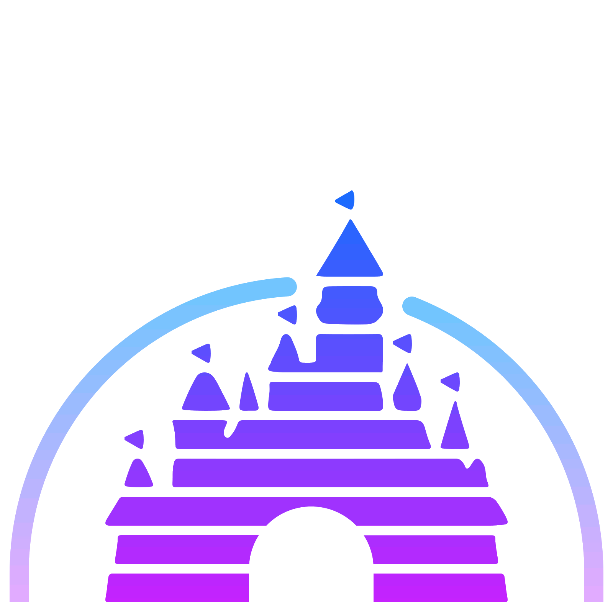

## REPTE-ACTIVITAT 3:
> Visionant el futur amb les ulleres de Manovich: redescobrint la hibridació
---

#   WhatsApp:
El primer cas d'exemple d'hibridació que vull abordar és l'aplicació per smartphone **Whatsapp**. 

#   Parcs Disney: 

Lev Manovich ens diu al seu llibre “El software toma el mando”, que “Los híbridos pueden combinar y reconfigurar formatos de medios conocidos e interfaces de medios para ofrecer nuevos tipos de representación híbridas .” (Manovich, 2013). Per tant, podem considerar els parcs Disney com elements híbrids en l’àmbit de l’entreteniment i de l’experiència multimèdia. Ho considero així degut a la infinitats de combinacions que prenen els diferents medis i les diferents tecnologies utilitzades, ja no només en les atraccions, sinó també en la recreació de l’univers Disney i la forma amb la que els usuaris hi poden interactuar, passant a ser una part activa d’aquest món. 

L’experiència en aquests parcs comença abans d’entrar-hi. Es podem fer tours virtuals a través de Google Earth o a través de la pàgina de visitorlando.com, en el cas del parc d’aquesta ciutat. Mentre ens dirigim al parc, podem descarregar l’aplicació mòbil que ens ajudarà a geolocalitzar-nos dins del parc, conèixer el temps d’espera a cada atracció, o a fer reserves per els restaurants. També podem controlar els horaris de diferents espectacles o les rues itinerants dins del parc, i tot des d’una mateixa interfície d’usuari a través de la mateixa app.

Si parlem de les atraccions d’última generació que existeixen avui en dia, som incapaços d’imaginar tota la tecnologia combinada que existeix a cada una d’elles. Per posar un exemple on es combinen moltes d’aquestes tecnologies en una sola atracció, podem parlar de la de Ratatoullie, que ens submergim a una història on ens posem a la pell d’un ratolí que recorre i s’amaga per tots els racons de la cuina d’un restaurant.  

Per simular això l’usuari és transportat, amb ulleres 3D i en un vehicle autònom sense raïls, per diferents habitacions ambientades amb la pel·lícula del mateix nom. A través de projeccions de pantalla 3D a cada sala, també apareixen efectes reals com olors, aigua, aire i canvis de temperatura, que fan que l’usuari és transporti realment a la història que l’atracció ens vol explicar. A més, es combina el moviment del vehicle amb la sincronització dels efectes sonors i 4D per generar una immersió total.

[Ratatouille: The Adventure Ride](https://www.youtube.com/watch?v=WtZdXqY1TKs)

En aquest cas particular podem dir que no es tracta d’un software que utilitzi l’usuari a través d’una sola interfície, però si que podem dir que la combinació de tots aquests elements multimèdia em generen un de nou i únic, impossible de generar si aïlléssim tots els medis de forma individual.

L’aplicació mòbil que hem mencionat al principi també forma part d’aquest conjunt de medis que fan que visitar un parc Disney sigui una experiència hibrida. Utilitzant el dispositiu mòbil i connexió a internet, l’aplicació fa de nexe entre el visitant i el parc. És la forma que té l’usuari d’interactuar amb tot allò que l’envolta i li facilita conèixer, a través de vídeos imatges i ressenyes, totes les atraccions, els restaurants o els espectacles abans d’anar-hi.
Qui hagi estat en un parc Disney, també sabrà que cada nit abans de tancar portes, es genera un espectacle al castell central del parc on es reprodueix un videomaping sobre la façana del castell, combinant música vídeo i pirotècnia.

